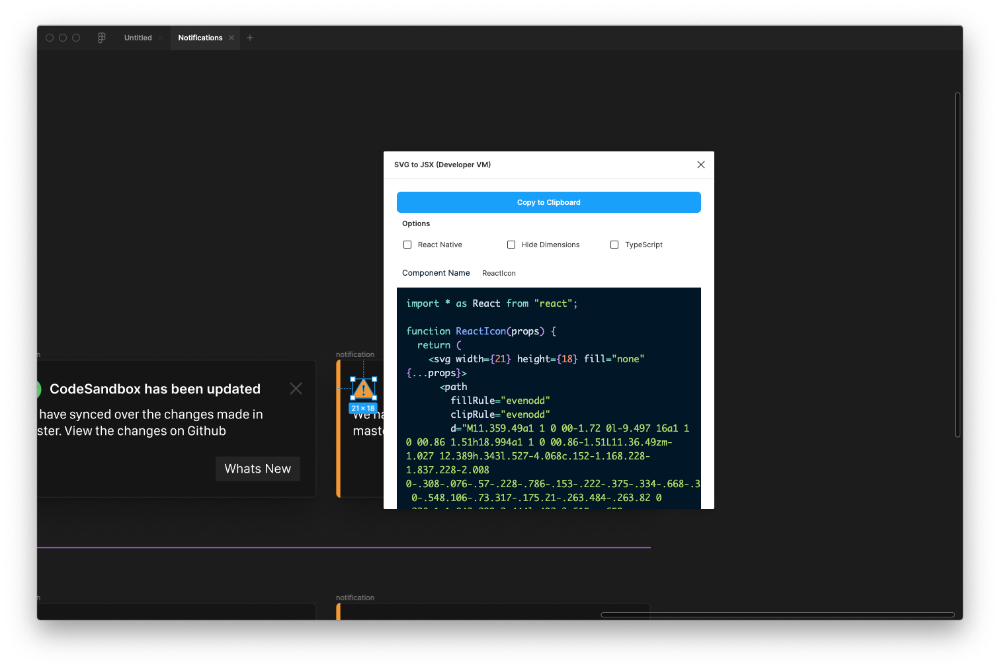

# SVG to JSX Figma Plugin

[](https://www.figma.com/community/plugin/749818562498396194/SVG-to-JSX)
[](https://www.figma.com/community/plugin/749818562498396194/SVG-to-JSX)



This plugins does what it says really, gets your SVG code in figma and gives you ready to use JSX you can copy and paste into your react apps and its written in ...🥁🥁 VUE 🥁🥁...

Remember kids, the framework wars are not good.

Features:

- JSX Export
- React Native export
- Typescript Export
- Icon Mode, where all the svg size gets replaced with "1em"
- Change the Icon name

## How to run locally

You will need the figma desktop app you can download [here](https://www.figma.com/downloads/).

Then clone the repo and run:

```bash
yarn && yarn start:ui
```

If you want top change the API you will need to run:

```bash
yarn && yarn start
```

Also uncomment [this line](https://github.com/SaraVieira/svg-to-jsx/blob/05f9c645332f07b4e68129b8e42389abcd1a7345/src/ui.html#L127) and comment the one after it so it uses the dev server and not the deployed one.

Add it to figma by going to "Your Face > Plugins" and clicking on create a new plugin, this will give you the option to link to an existing plugin and you can select the `manifest.json` in this directory.

Open figma and right click a component and you can access the plugin in Plugins > Development > SVG to JSX.

When making changes go to Menu > Plugins > "Run Last Plugin" (Or hit ⌥⌘P for Mac or Ctrl+Alt+P for Windows).
